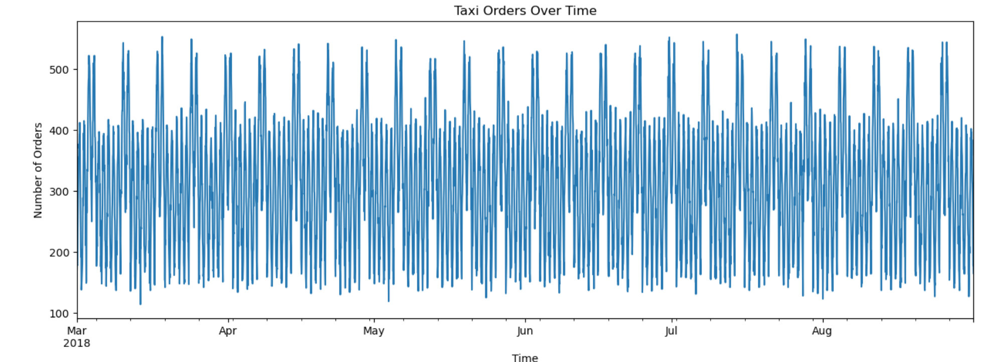
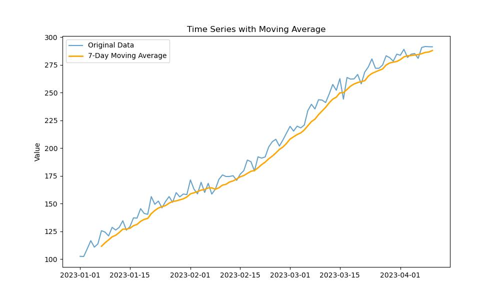
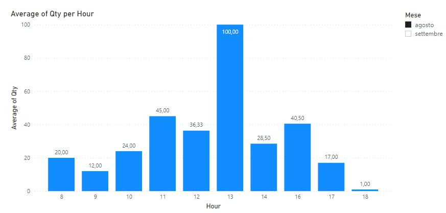
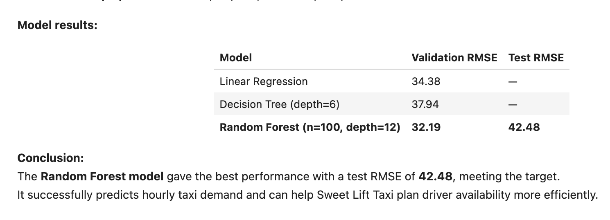

# Taxi Demand Forecasting

## Overview
This project predicts hourly taxi demand using time series data.

## Goal
The goal was to forecast demand accurately to help improve driver allocation and reduce wait times.

## What I Did
- Analyzed time-based patterns such as daily and weekly trends
- Created lag features and rolling averages
- Trained multiple models including Random Forest
- Evaluated model performance using RMSE

## Project Visuals

### Taxi Demand Over Time

### Trend with Moving Average

### Demand by Hour of Day

### Model Performance

## Results
- Achieved an RMSE of 42
- Successfully captured demand patterns using time-based features

 ## Key Insights
- Taxi demand shows strong daily seasonality patterns  
- Peak demand occurs during specific hours of the day  
- Rolling averages help smooth short-term fluctuations  
- Machine learning models can effectively forecast hourly demand

## Future Improvements
- Incorporate external factors such as weather or events  
- Experiment with advanced time series models  
- Improve feature engineering for better forecasting accuracy  

## Tools Used
- Python
- Pandas
- Scikit-learn

## How to Run

1. Clone the repository:
git clone https://github.com/loran83/taxi-demand-forecasting.git

2. Install dependencies:
pip install pandas numpy scikit-learn matplotlib

3. Open the notebook:
taxi_demand_forecasting.ipynb
